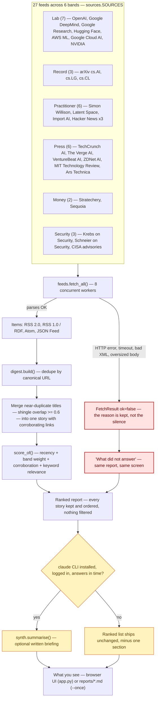

# Dawnpatrol

What happened in AI yesterday, swept from 27 feeds before the day starts and
ranked for the kind of company you actually advise — not for AI in general.

[](https://www.python.org/)
[](https://github.com/blaine-hiers/Dawnpatrol/actions/workflows/ci.yml)
[](LICENSE)
[](strategy/dawnpatrol/feeds.py)

## Quickstart

```
py strategy/dawnpatrol/app.py            # opens in your browser
py strategy/dawnpatrol/app.py --once     # headless, for a 6am scheduled run
py strategy/dawnpatrol/app.py --check    # are the feeds still alive?
py run_all_tests.py                      # 92 tests
```

Windows: double-click `run.cmd`.

## How a morning report gets made

Twenty-seven feeds across six trust bands are fetched concurrently. A feed
that fails is carried through the pipeline as a reported fact, not dropped —
it surfaces in the same report under "What did not answer" instead of a log
nobody reads. Everything that *is* collected survives every later stage:
nothing is filtered for scoring low, only deduplicated, clustered, and
ordered.



The red path is deliberate: a broken feed is reported on the screen the
report itself is shown on, not buried in a log — a 404 looks nothing like a
quiet week, and the pipeline is built to keep those two facts apart. The
yellow path is the one part of the pipeline allowed to fail without taking
the report down with it (see [The optional briefing](#the-optional-briefing)).

## What it does that a feed reader does not

**It collapses the story, not the articles.** One announcement carried by six
outlets becomes one story with six links, so a big day does not look like six
big days.

**It ranks for a stated audience.** Set `DAWNPATROL_AUDIENCE` to a sentence or
two describing your customers and the written briefing is tuned to them. The
default is a generic small-business profile. A ranking tuned to somebody else's
customers is worth nothing to you.

**Nothing is ever filtered out.** Everything collected is kept and ordered. A
tool that quietly hides what it judged uninteresting narrows what you know
without telling you — and you cannot audit an absence.

**A broken source is on the screen, not in a log.** A feed that 404s looks
exactly like a quiet week, and arXiv being empty on a Saturday is a third thing
again. All three are reported differently, because treating them the same is how
you end up confidently briefing on a source that died in March.

**The ranking shows its arithmetic.** Every score can be taken apart.

## Command reference

| Command | Does |
|---|---|
| `py app.py` | Opens the GUI in your browser |
| `py app.py --once` | Collects, writes a report, and exits — for a scheduled run |
| `py app.py --check` | Probes every source and reports which ones answer; nothing is stored |

`--once` accepts these, editable at the bottom of `run-daily.cmd`:

| Flag | Effect |
|---|---|
| `--days N` | Widens or narrows the collection window, 1–14 days (default: 3) |
| `--no-summary` | Skips the optional Claude briefing, keeping the ranked list only |
| `--quiet` | Suppresses console output (used by the scheduled task) |

`--once`'s exit code tells a scheduler what happened without it having to
parse output: `0` a report was written, `1` every source failed, `2` it ran
but more than half the sources failed.

| Environment variable | Effect |
|---|---|
| `DAWNPATROL_AUDIENCE` | A sentence or two describing your customers. Tunes both the ranking and the briefing. Default: a generic 10–50 person, trades/light-manufacturing profile. |

## Bands

Every feed is assigned a band, and a band's weight multiplies the score of
everything in it — a story from a lab's own blog and the same story rewritten
by a news site are worth different amounts.

| Band | Weight | What it is |
|---|---|---|
| Lab | ×1.35 | The people who built it, saying what they built. No middleman |
| Practitioner | ×1.25 | Builders and engineers. Where a claim first meets a real workload |
| Security | ×1.15 | The one-page risk scan needs feeding. This is what feeds it |
| Record | ×1.10 | arXiv. Early, dense, and occasionally six months ahead of the press |
| Money | ×1.00 | Where the funding goes, which is where the tooling goes next |
| Press | ×0.85 | Wide coverage, thin detail. Good for what a client will have read |

## The feed list was checked, not assembled

Every feed in `sources.py` was fetched before it was written down. The eight
that 404'd are **recorded in the file with their failure** rather than deleted,
so nobody researches them twice — including one major lab that publishes no
public feed at all.

## The optional briefing

If the `claude` CLI happens to be on the machine, a headless run adds a few
paragraphs of "so what" on top of the ranked list. If it is not there, is not
logged in, or takes too long, **the report still ships**, unchanged, minus one
section.

That ordering is the whole design. Everything else here runs on the standard
library and nothing else, and this one part is not allowed to become the
exception that makes a morning report depend on a subscription, a network and a
login. The digest is the product; the briefing is a garnish that is permitted to
fail.

The user agent carries no email address and no private domain. It goes to
twenty-seven servers a day.

## Scheduling it

`strategy/dawnpatrol/install-schedule.cmd` registers a Windows scheduled task
for a 6am collection. The task runs `--once`, which writes a report and exits.

## Layout

```
_shared/               server, storage and design system (vendored — see below)
strategy/dawnpatrol/   the app
tests/                 92 tests, mirroring the app tree
```

`_shared/` is vendored from a larger private workspace of about twenty of these
apps that share one server base, one storage layer and one visual language. The
two-level `strategy/…` path is not decoration: the folder an app sits in decides
its colour, and the test tree mirrors the app tree exactly. Its comments
occasionally mention sibling apps that are not in this repo.

`tests/test_publishable.py` guards the seam between that private workspace and
this one — it fails if a copied file brings private fixture data back with it.

## Licence

MIT. See [`LICENSE`](LICENSE).
